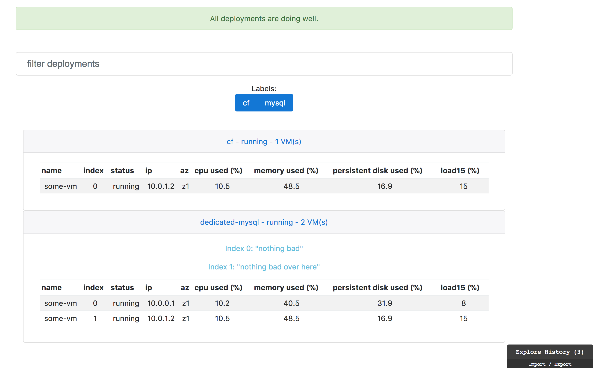

# BDD

BDD stands for bosh deployment dashboard. This BOSH release aims to provide a dashboard that quickly serves at-a-glance information about the deployments you manage. Please retrieve releases from the [releases page](https://github.com/aemengo/bosh-deployment-dashboard-release/releases).



## Installation

Installing requires prerequisite knowledge of the BOSH ecosystem. One can find out more at their [documentation site](http://bosh.io/docs). A minimal setup of bdd requires the **bdd-hub** job to be situated on a VM that can receive http traffic from other nodes in your deployments. There also needs to be at least one configured **bdd-agent**. These agent 'jobs' are typically collocated with another jobs and will automatically transit their own metrics to its configured **hub: addr**.
   
 ```yaml
 instance_groups:
 - name: bdd

...

   jobs:
   - name: bdd-hub
     release: bosh-deployment-dashboard
   - name: bdd-agent
     release: bosh-deployment-dashboard
 ```
 
 ## Features
 
 BDD agents also allow for the configuration of a **label** property. These can be set to arbitrary values for the sake of searching and grouping metrics.
 
 ```yaml
 
 ... 
 
   vm_type: default
   properties:
     label: test-drive #<--- Label configuration
     hub:
       ip: 127.0.0.1
       
 ```